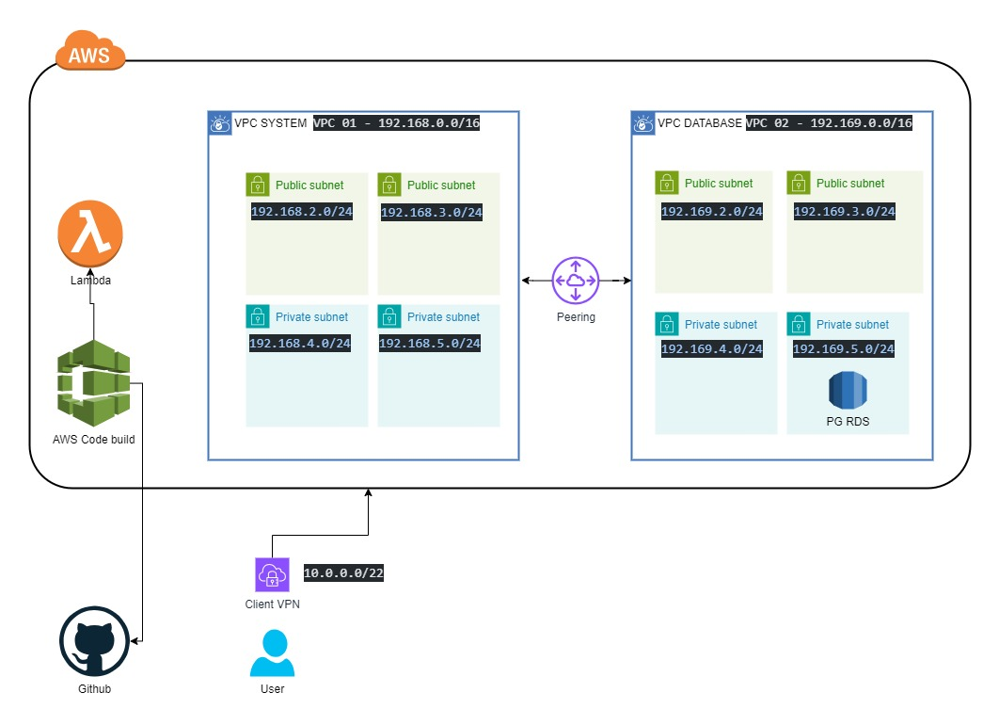

# AWS Cloudformation technical assessment

This GitHub repository contains AWS CloudFormation templates used for provisioning cloud infrastructure.
    

# Architecture 

This is the simple architecture diagram

   
# CIDRS

VPC 01 SYSTEM `192.168.0.0/16`  

VPC 02 DB `192.169.0.0/16`

CLIENT CIDR `10.0.0.0/22`
  
 # Commands to import vpn client and server certificates

`aws acm import-certificate --certificate fileb://server.crt --private-key fileb://server.key --certificate-chain fileb://ca.crt`
 

`aws acm import-certificate --certificate fileb://client1.domain.tld.crt --private-key fileb://client1.domain.tld.key --certificate-chain fileb://ca.crt `

# Contact
Created by [@chathunbandara](https://www.chathunz.com/) - feel free to contact me!

